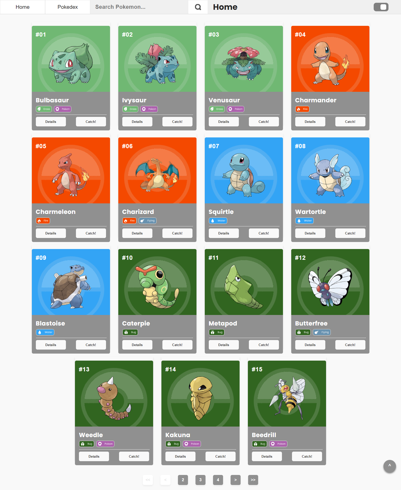
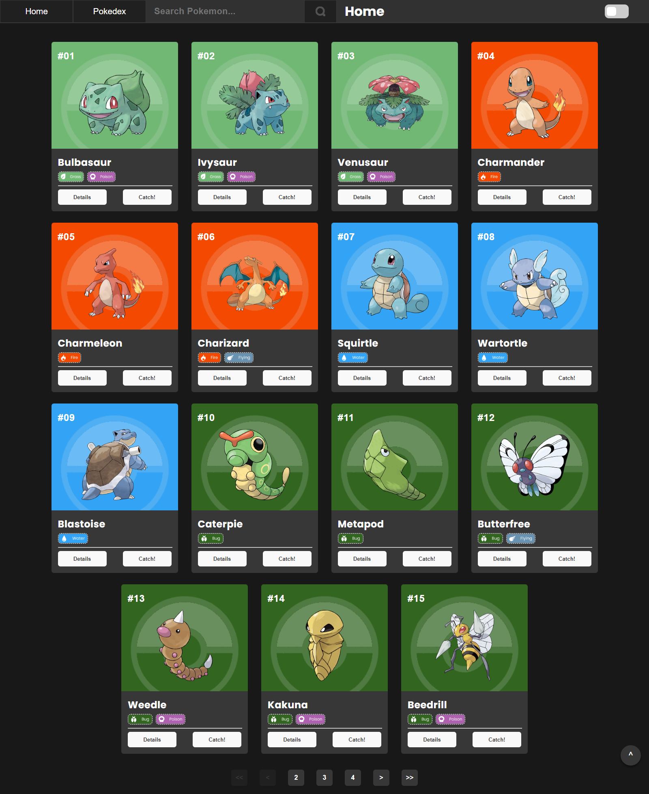
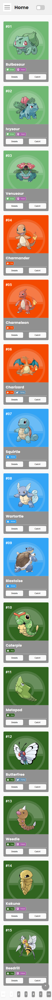
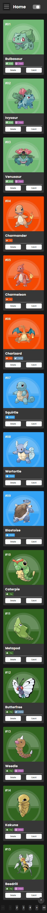

# Pokedex

Projeto desenvolvido para o teste da vaga de Desenvolvedor Front End na empresa Orma Carbon.
Escolhi o tema de uma pokedex, com consumo da api PokeAPI e com as seguintes funcionalidades:
- ``Header da página contendo botões para navegação entre a home page, pokedex, e input para busca dos pokemons por nome. Contém uma versão com menu sanduíche para visualização em dispositivos móveis;``
- ``Toggle para o usuário alternar entre modo light e dark, ficando salvo a última escolha do modo nos cookies do navegador;``
- ``Renderização de lista de pokemons em cards;``
- ``Em cada card consta dois botões: um para capturar ou excluir da pokedex, e outro para visualizar seus detalhes;``
- ``Botão de rolagem automática para o topo da página;``
- ``Botões para navegação da paginação da lista de pokemons;``

# Índice

* [Tecnologias usadas](#tecnologias-usadas)
* [Imagem do projeto](#imagem-do-projeto)
* [Deploy](#deploy)
* [Rodando o Projeto](#rodando-o-projeto)

## Tecnologias usadas:

- ``React.js``
- ``Next.js``
- ``Styled Components``
- ``Nookies``
- ``React Hooks``

## Imagem do projeto:

## Deploy:

- ``Vercel`` | Link: <https://frontend-test-two-paulajardimf.vercel.app/>

## Rodando o projeto:
- Rode o console na pasta em que você baixou os arquivos;

- Insira o comando ``npm install``;

- Depois, o comando ``npm run dev`` para rodar no navegador.
