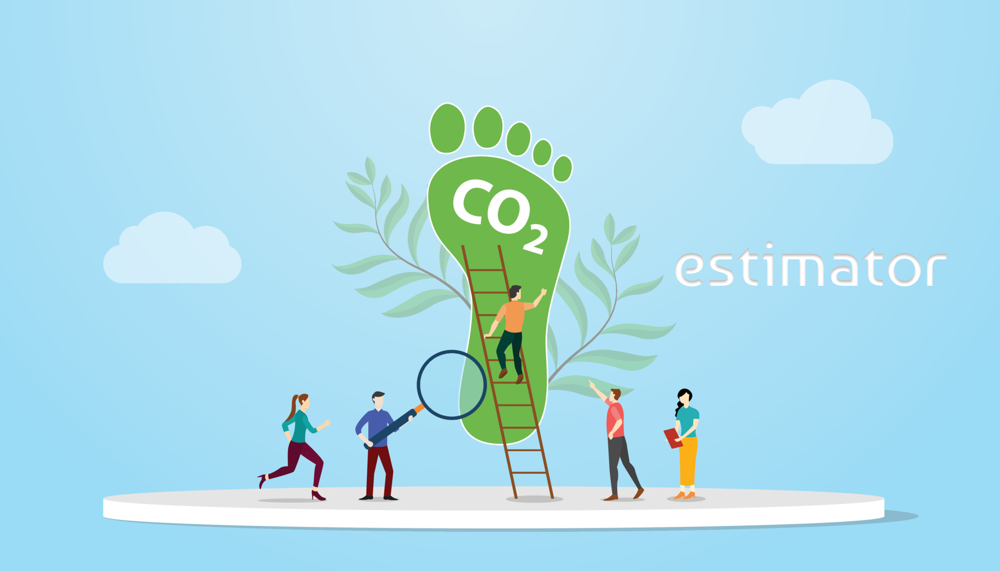
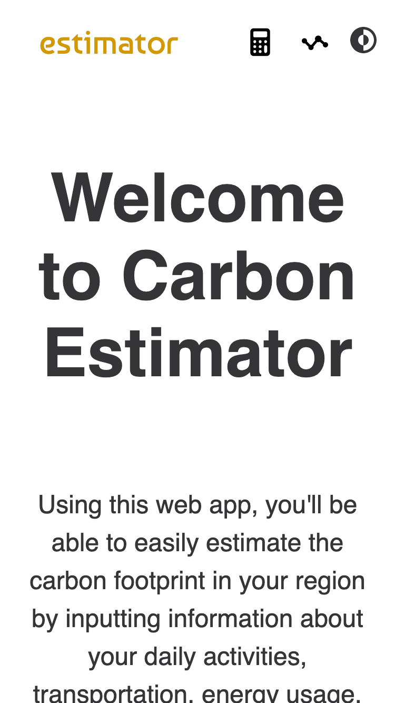
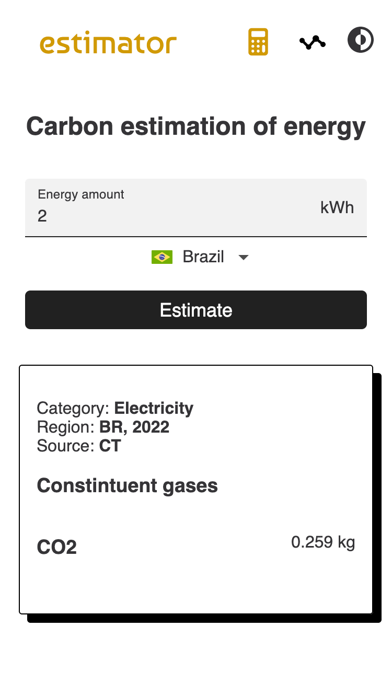
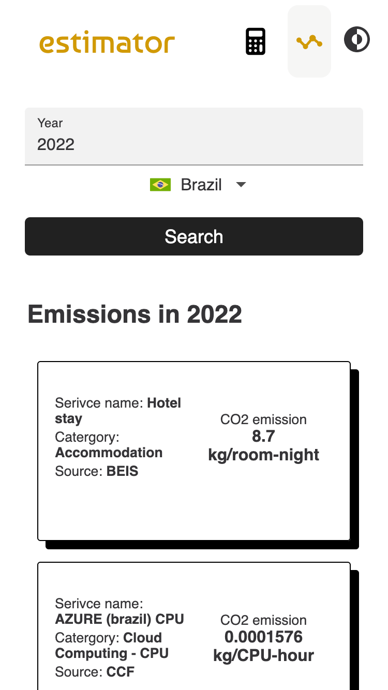
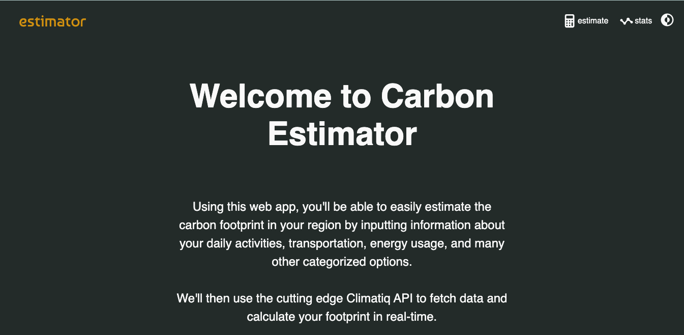

<p align="center">
  

  
  
  <a href="https://github.com/f7lipe/frontend-test-two/commits/master">
    
  </a>
    
</p>
<h1 align="center">
    
</h1>

<strong>Português 🇧🇷</strong>
<br>
[English 🇺🇸](./README-en.md) 

<h4 align="center"> 
	🚧 estimator - [ MVP ] 🚧
</h4>

<p align="center">
 <a href="#-sobre-o-projeto">Sobre</a> •
 <a href="#-funcionalidades">Funcionalidades</a> •
 <a href="#-layout">Layout</a> • 
 <a href="#-como-executar-o-projeto">Como executar</a> • 
 <a href="#-tecnologias">Tecnologias</a> • 
 <a href="#-autor">Autor</a> • 
 <a href="#-referências">Referências</a>
</p>


## 💻 Sobre o projeto

O objetivo por trás desse projeto é fornecer aos usuários uma ferramenta simples e fácil de usar para estimar a pegada de carbono de suas atividades diárias. Seja indo para o trabalho, fazendo compras, ou até mesmo passando o tempo no hotel, este aplicativo calculará as emissões de carbono estimadas associadas a essas atividades.

Atualmente, o aplicativo está em desenvolvimento e novos recursos serão adicionados no futuro para aprimorar ainda mais a experiência do usuário e adicionar mais atividades à lista.

Ao fornecer essas informações aos usuários, eles podem tomar decisões mais informadas sobre seus hábitos diários e potencialmente reduzir sua pegada de carbono. Sinta-se livre para baixar, modificar e dar feedback!

---

## ⚙️ Funcionalidades

   Os usuários tem acesso ao aplicativo web ( responsividade móvel e dekstop ), onde podem:
  - [x] estimar a pegada de carbono de uma determinada categoria para o seu país (localização obtida via IP)  
  - [x] alterar o país em um seletor de países 
  - [x] filtrar por ano e região as categorias que mais emitem CO2
  - [x] alternar entre os temas claro/escuro
 
---

## ▶️ Prévia

Este projeto conta com uma versão de demonstração hospedada na Vercel. Clique [aqui](https://estimator-ouobmeo69-f7lipe.vercel.app/) e confira. 

## 🎨 Layout

O layout da aplicação está disponível no Figma:

<a href="https://www.figma.com/file/ybGM12I43VwEIB1ZAlLZo9/Estimator?node-id=0%3A1&t=0Fwzhkrt5hKdWqSR-1">
  
</a>


### Mobile

<p align="center" style="display: flex; align-items: flex-start; justify-content: center;">
  
  
  
</p>

### Desktop

<p align="center" style="display: flex; align-items: flex-start; justify-content: center;">
  
</p>

---

## 🚀 Como executar o projeto

Este projeto requer dependências de terceiros para funcionar, confira abaixo os passos para executar localmente. 

### Pré-requisitos

Antes de começar, você vai precisar ter instalado em sua máquina as seguintes ferramentas:
[Git](https://git-scm.com), [Node.js](https://nodejs.org/en/), e também um gerenciador de pacotes como [npm](https://www.npmjs.com/package/npm) ou [yarn](https://classic.yarnpkg.com/lang/en/docs/install/). 
Além disto é bom ter um editor para trabalhar com o código, como [VSCode](https://code.visualstudio.com/)

#### 🔑 Obtenha uma chave de API do Climatiq 

Para poder funcionar, este projeto é alimentado pela base de dados do Climatiq. A [Climatiq](https://www.climatiq.io) oferece uma API REST que traz dados e informações relacionadas a fatores climáticos e ambientais, como temperatura, umidade, emissões de carbono em escala local e global. 

Para obter uma chave gratuita siga as intruções oficiais [aqui](https://www.climatiq.io/docs/guides/getting-api-key) (conteúdo em inglês).  

#### 🧭 Rodando a aplicação web

```bash

# Clone este repositório
$ git clone git@github.com:f7lipe/frontend-test-two

# Acesse a pasta do projeto no seu terminal/cmd
$ cd f7lipe/frontend-test-two

# Instale as dependências
$ npm install // yarn install

# crie uma variável de ambiente
$ touch .env.local 

# no arquivo .env.local criado adicione uma variável API_BASE_URL e API_KEY como mostrado no arquivo .env.example localizado na pasta raíz deste diretório
$ nano .env 

API_BASE_URL = "https://beta3.api.climatiq.io"
API_KEY = "COLE AQUI SUA CHAVE DE API DO CLIMATIQ.IO"

# salve a alteração

# Execute a aplicação em modo de desenvolvimento
$ npm run dev // yarn run dev

# A aplicação será aberta na porta:3000 - acesse http://localhost:3000

```

---

## 🛠 Tecnologias

As seguintes ferramentas foram usadas na construção do projeto:

#### **Website**  ([Next.JS](https://nextjs.org))  +  ([JavaScript](https://www.javascript.com))

-   **[Axios](https://github.com/axios/axios)**
-   **[React Hook Form](https://react-hook-form.com)**
-   **[React Icons](https://react-icons.github.io/react-icons/)**
-   **[Styled-components](https://styled-components.com/)**

> Veja o arquivo [package.json](https://github.com/f7lipe/frontend-test-two/package.json)


#### Utilitários

-   Protótipo:  **[Figma](https://www.figma.com/)**  →  **[Protótipo (Estimator)](https://www.figma.com/file/ybGM12I43VwEIB1ZAlLZo9/Estimator?node-id=0%3A1&t=0Fwzhkrt5hKdWqSR-1)**
-   Editor:  **[Visual Studio Code](https://code.visualstudio.com/)**  → Extensions:  **[vscode-styled-components](https://marketplace.visualstudio.com/items?itemName=styled-components.vscode-styled-components)**
-   Markdown:  **[StackEdit](https://stackedit.io/)**,  **[Markdown Emoji](https://gist.github.com/rxaviers/7360908)**
-   Teste de API:  **[Thunder Client](https://marketplace.visualstudio.com/items?itemName=rangav.vscode-thunder-client)**
-   Fontes: **[Roboto](https://fonts.google.com/specimen/Roboto)**
---

## 🦸 Autor

<a href="https://github.com/f7lipe">
 
 <br />
 <sub><b>Filipe Correia</b></sub></a>
 <br />

[](https://www.linkedin.com/in/f7lipe/) 
[](mailto:filipe.rcs@icloud.com)
[](https://twitter.com/f7lipe) 

---
## 📚 Referências 

- [Climatiq API Reference](https://www.climatiq.io/docs)
- [Directory Structure Suggestion For Next.JS](https://medium.com/@pablo.delvalle.cr/an-opinionated-basic-next-js-files-and-directories-structure-88fefa2aa759)
- [MDN Web Docs](https://developer.mozilla.org/pt-BR/)
- [Next.JS Docs](https://nextjs.org/docs/getting-started)
- [React Hook Forms Docs](https://react-hook-form.com/get-started)
- [React Infinite Scroll](https://medium.com/suyeonme/react-how-to-implement-an-infinite-scroll-749003e9896a)
- [Theming in Next.JS With Styled-components](https://blog.logrocket.com/theming-in-next-js-with-styled-components-and-usedarkmode/)

## 📝 Projeto

Este projeto é parte de um desafio técnico feito para a [Orma Carbon](https://github.com/ormacarbon).

Feito com ❤️ por Filipe Correia 👋🏽 [Entre em contato!](https://www.linkedin.com/in/f7lipe/)

---
