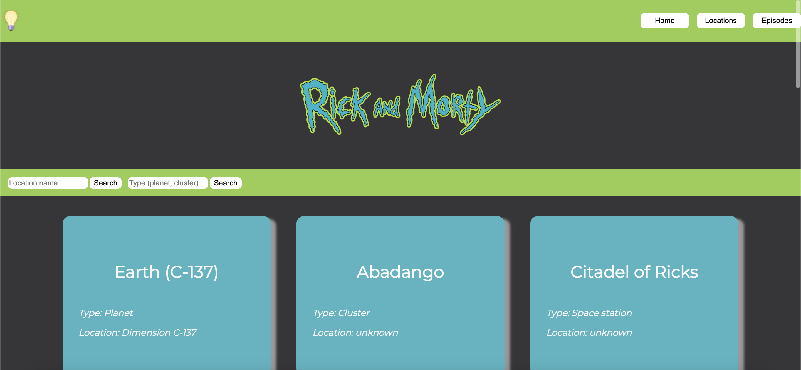

# **Project API - Rick and Morty**

The API - Rick and Morty is a website with information about the Adult Swim show "Rick and Morty", that contains 4 pages: Home, Detalhes, Locations and Episodes. The project has, as a source of data, the [Rick and Morty API](https://rickandmortyapi.com/ "Rick and Morty API").

## **Index**
- <a href="#project-functionalities">Project functionalities</a>
- <a href="#layout">Layout</a>
- <a href="#deploy">Deploy</a>
- <a href="#how-can-i-run-this-project">How can I run this project?</a>
- <a href="#tech-stack">Tech stack</a>
- <a href="#creators">Creators</a>

## **Project functionalities**
- [x] Button that changes the website theme (dark/light)
- [x] List on the home page with Rick and Morty characters
- [x] Page with character details
- [x] Page with a list of locations
- [x] Page with a list of episodes
- [x] Inputs available to search by name, character status, location type and episode code
- [x] Fully responsive for all types of devices/screens

## **Layout**





## **Deploy**
[Deploy link](https://rick-and-morty-api-project.vercel.app/)

## **How can I run this project?**

```
# Clone this repository
$ git clone link-repositorio

# Acess the project folder on your terminal
$ cd frontend-test-two

# Install dependencies
$ yarn install

# Run application
$ yarn dev

```

## **Tech stack**

1. [React](https://pt-br.reactjs.org/)
2. [Next.js](https://nextjs.org/)
3. [Styled-components](https://styled-components.com/)
4. [Axios](https://axios-http.com/)


## **Creators**


[Linkedin](https://www.linkedin.com/in/mariaconstance/)

